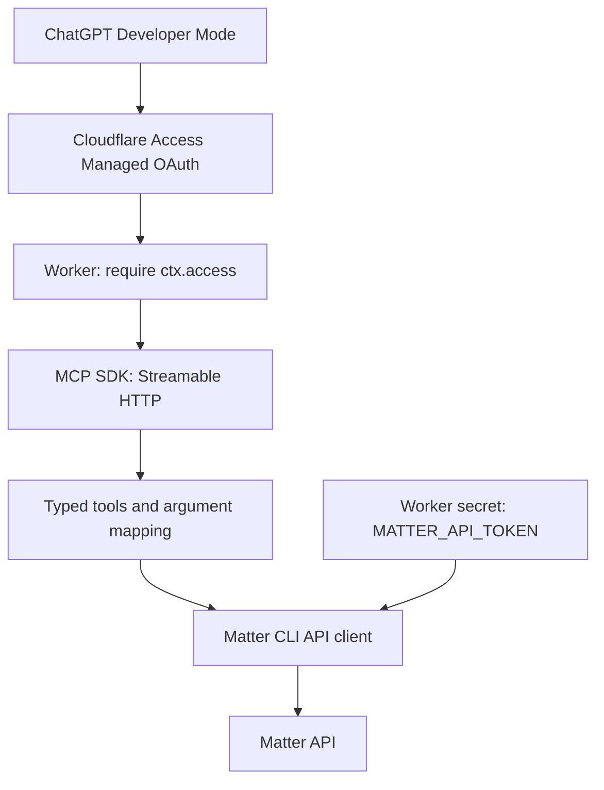

# Matter MCP design

Updated: 2026-09-21. Initial implementation exists. Cloud deployment and live ChatGPT connectivity have not been verified.

## Scope

One self-hosted deployment connects one Matter account to ChatGPT Developer Mode. Users run their own instances. The public deliverable is source code and installation instructions.

Tool names and arguments follow Matter CLI. Reuse its internal MatterAPI class without duplicating the HTTP client. Run on Workers without a CLI process, container, Docker, or CLI configuration file.

## Architecture

Access allows the owner's email. The Worker requires Cloudflare's trusted ctx.access context and delegates authentication and authorization to the Access policy protecting the incoming request. It does not parse tokens, fetch signing keys, or maintain separate issuer/audience settings. Requests without context are rejected even if they supply authentication headers.

All identities admitted by the applicable Access policy can use the single configured Matter account. Any additional hostname or preview must have an appropriate policy; the Worker does not restrict requests to a separately configured Access application. This intentionally relies on Cloudflare's policy configuration as the authorization boundary. Direct Worker invocation is required; Service Bindings and Static Assets routers do not propagate this context.

The Matter token is passed from a Worker secret into a request-local API client. It is separate from OAuth credentials and is not a tool argument or part of the bundled code.

Managed OAuth is the initial authentication approach. Discovery, resource handling, PKCE, redirect registration, client registration, token refresh, and reconnect behavior still require live integration testing. Do not add a custom OAuth server, database, or KV store preemptively.

## Upstream reuse and updates

Import matter-cli/src/api.ts through a normal Git dependency. The initial bundle includes only this module and src/version.ts from Matter CLI. The client uses standard fetch.

This is an internal module rather than a supported SDK. Use normal package resolution and a lockfile. Do not introduce custom version pinning, update suppression, update scripts, polling, GitHub Actions, notifications, or rollback infrastructure.

Importing the client does not invoke the CLI updater. Deployed code remains unchanged until rebuilt and redeployed. Do not download executable code at runtime or automatically expose new tools when upstream changes.

## MCP interface

- One stateless Streamable HTTP endpoint at /mcp, with JSON responses. The official SDK handles the protocol. Authenticated GET requests return 405.
- Seventeen typed tools. No arbitrary command execution, custom UI, Resources, Prompts, or Tasks.
- Validate input types, enums, ranges, and path identifiers.
- Return upstream JSON as structuredContent and JSON text. Void results become a minimal success object.
- Convert API failures to isError results, preserving status, code, and field. Do not return internal stacks.
- Annotate read-only and destructive operations. Annotations do not replace authorization.
- In read-only mode, omit write tools and reject attempts to invoke them.
- Fetch one page per call and preserve has_more and next_cursor. Do not implement unbounded --all behavior.
- Custom deadlines and output caps are not implemented. The upstream client has no AbortSignal injection point. Do not silently truncate content; treat failed writes as potentially completed.
- Do not automatically retry writes. Surface rate-limit failures. The current client does not retain Retry-After, so do not invent a retry delay.

## Tool mapping

| MCP tool | MatterAPI method | Inputs |
|---|---|---|
| account | getAccount | None |
| items_list | listItems | status, tag, content_type, favorite, order, updated_since, limit, cursor |
| items_get | getItem | id, include |
| items_save | saveItem | url, status |
| items_update | updateItem | id, status, favorite, progress |
| items_delete | deleteItem | id |
| annotations_list | listAnnotations | item, limit, cursor |
| annotations_get | getAnnotation | id |
| annotations_update | updateAnnotation | id, note |
| annotations_delete | deleteAnnotation | id |
| tags_list | listTags | None (CLI-compatible initial interface) |
| tags_rename | renameTag | id, name |
| tags_delete | deleteTag | id |
| tags_add | addTagToItem | item, name |
| tags_remove | removeTagFromItem | item, tag |
| search | search | query, type, status, limit, cursor |
| reading_sessions_list | listReadingSessions | since, limit, cursor |

Only map naming differences such as favorite to is_favorite, progress to reading_progress, and item to item_id. Preserve false, omitted fields, and empty notes. For items_list, favorite=false leaves the filter unset to match the CLI; for items_update it clears the favorite. Require at least one field for updates.

Keep upstream ordering defaults. Explain library_position for queue order, inbox_position for inbox order, and updated for synchronization.

The API client supports tag pagination and note:null beyond the initial CLI surface. Keep the initial interface CLI-compatible. tags_list does not guarantee a complete listing if has_more is true. Extend the interface only when needed.

## Distribution and onboarding

Distribute a public Git repository with a Deploy to Cloudflare button once the repository URL is available.

1. Choose the Worker hostname and prepare a hostname-based Access application before deployment.
2. Allow the owner's email, enable Managed OAuth, and prepare the Matter API token.
3. Supply the Matter token through the Deploy button form, or deploy code and secrets together with Wrangler --secrets-file.
4. Register the deployed /mcp URL in ChatGPT and verify account and item reads.

Declare required secret names using Wrangler's secrets.required. Use .dev.vars.example and package.json binding descriptions for Cloudflare's standard deployment form. Runtime rejection remains a fallback, not a required onboarding stage.

Access applications are not included in the Deploy button's documented automatic provisioning resources. Keep this initial setup explicit. Do not add a custom provisioning service or infrastructure framework.

## Costs and verification

Target the Workers free tier, subject to CPU measurement of MCP initialization, schema creation, Access-context checks, and response processing. Containers are not required. Matter and Access requirements apply separately.

Type checking, five tests, and Worker bundling pass with the Access-context implementation. Tests mock ctx.access; production Access behavior still needs a live check. Remaining verification includes live Matter operations, deployed CPU use, ChatGPT/Managed OAuth compatibility, and the complete deployment flow. Required-secret deployment checks do not validate the Matter token or the Access policy.

## Implementation

- src/worker.ts: Access Access-context checks, Origin checks, and HTTP transport.
- src/server.ts: Tool schemas, annotations, argument mapping, and result/error conversion.
- Standard npm dependency configuration, Wrangler configuration, example secrets, and README.

Prioritize tests for the authentication boundary, CLI argument semantics, pagination preservation, upstream errors, read-only mode, and HTTP interoperability. Use explicitly authorized test data for live write tests.

## References

- [Matter CLI API client](https://github.com/getmatterapp/matter-cli/blob/da5465eaaa2fde2cfe6ef34eff7772ea723eb957/src/api.ts)
- [Matter CLI](https://github.com/getmatterapp/matter-cli)
- [ChatGPT Developer Mode](https://developers.openai.com/api/docs/guides/developer-mode)
- [OpenAI MCP authentication](https://developers.openai.com/plugins/build/auth)
- [MCP Tools](https://modelcontextprotocol.io/specification/2025-11-25/server/tools)
- [MCP Streamable HTTP](https://modelcontextprotocol.io/specification/2025-11-25/basic/transports)
- [Access Managed OAuth](https://developers.cloudflare.com/cloudflare-one/access-controls/applications/http-apps/managed-oauth/)
- [Access Access-context checks](https://developers.cloudflare.com/cloudflare-one/access-controls/applications/http-apps/authorization-cookie/validating-json/)
- [Deploy to Cloudflare](https://developers.cloudflare.com/workers/platform/deploy-buttons/)
- [Workers pricing](https://developers.cloudflare.com/workers/platform/pricing/)
